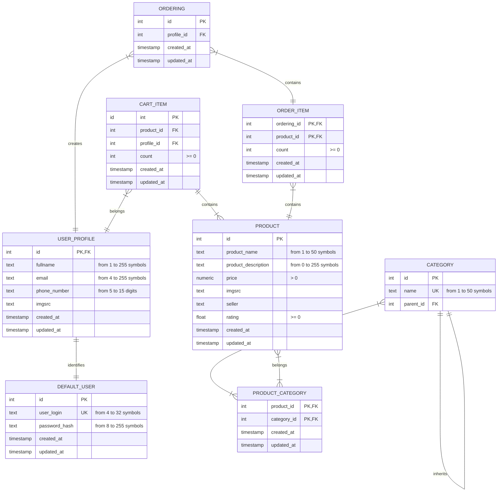

# ER-диаграмма

# Описание функциональной зависимости отношений

> Ни в одной из таблиц не используются составные типы, поэтому 1 НФ выполяняется.

## default_user
> Хранит пользователей.

### Отношения
`{ id } -> { user_login, password_hash, created_at, updated_at }`  

### НФ
**2 НФ**: Ключ не составной, поэтому не может быть зависимости от части ключа. Т.е. таблица удовлетворяет 2-й нормальной форме.  
**3 НФ**: Каждый столбец зависит только от ключевого столбца, поэтому 3 НФ также выполняется.  
**НФ Бойса-Кодда**: _(Аналогично с default_user)_ Ключевой атрибут не зависит от неключевых.

## user_profile
> Хранит профили пользователей. Id профиля совпадает с Id пользователя.

### Отношения
`{ id } -> { full_name, email, phone_number, imgsrc, created_at, updated_at }`

### НФ
**2 НФ**: _(Аналогично с default_user)_ Ключ не составной, поэтому не может быть зависимости от части ключа. Т.е. таблица удовлетворяет 2-й нормальной форме.  
**3 НФ**: _(Аналогично с default_user)_ Каждый столбец зависит только от ключевого столбца, поэтому 3 НФ также выполняется.  
**НФ Бойса-Кодда**: _(Аналогично с default_user)_ Ключевой атрибут не зависит от неключевых.

## product
> Хранит товары.

### Отношения
`{ id } -> { product_name, product_description, price, imgsrc, seller, rating, created_at, updated_at }`

### НФ
**2 НФ**: _(Аналогично с default_user)_ Ключ не составной, поэтому не может быть зависимости от части ключа. Т.е. таблица удовлетворяет 2-й нормальной форме.  
**3 НФ**: _(Аналогично с default_user)_ Каждый столбец зависит только от ключевого столбца, поэтому 3 НФ также выполняется.  
**НФ Бойса-Кодда**: Ключевой атрибут не зависит от неключевых.

## category
> Хранит категории. Из-за иерархической структуры каждая категория сслылается на родительскую категорию.

### Отношения
`{ id } -> { category_name, parent_id }`

### НФ
**2 НФ**: _(Аналогично с default_user)_ Ключ не составной, поэтому не может быть зависимости от части ключа. Т.е. таблица удовлетворяет 2-й нормальной форме.  
**3 НФ**: _(Аналогично с default_user)_ Каждый столбец зависит только от ключевого столбца, поэтому 3 НФ также выполняется.  
**НФ Бойса-Кодда**: _(Аналогично с default_user)_ Ключевой атрибут не зависит от неключевых.

## product_category
> Хранит информацию о принадлежности товара к категории. У товара может быть несколько категорий и в категории несколько товаров.

### Отношения
`{ product_id, category_id } -> { created_at, updated_at }`

### НФ
**2 НФ**: Ни один из неключевых атрибутов не зависит только от части ключа - только связка `product_id` + `category_id` может уникально идентифицировать кортеж. Т.е. таблица удовлетворяет 2-й нормальной форме.  
**3 НФ**: Каждый столбец зависит только от составного ключа, поэтому 3 НФ также выполняется.  
**НФ Бойса-Кодда**: Ключевые атрибуты не зависят от неключевых.

## ordering
> Хранит заказ. У каждого профиля может быть несколько заказов, поэтому товары привязываются не к профилю, а к одному из заказов.

### Отношения
`{ id } -> { profile_id, order_status, created_at, updated_at }`

### НФ
**2 НФ**: _(Аналогично с default_user)_ Ключ не составной, поэтому не может быть зависимости от части ключа. Т.е. таблица удовлетворяет 2-й нормальной форме.  
**3 НФ**: _(Аналогично с default_user)_ Каждый столбец зависит только от ключевого столбца, поэтому 3 НФ также выполняется.  
**НФ Бойса-Кодда**: _(Аналогично с default_user)_ Ключевой атрибутт не зависит от неключевых.

## order_item
> Хранит товары из заказов.

### Отношения
`{ ordering_id, product_id } -> { count, created_at, updated_at }`

### НФ
**2 НФ**: Ни один из неключевых атрибутов не зависит только от части ключа - только связка `ordering_id` + `product_id` может уникально идентифицировать кортеж. Т.е. таблица удовлетворяет 2-й нормальной форме.  
**3 НФ**: Каждый столбец зависит только от составного ключа, поэтому 3 НФ также выполняется.  
**НФ Бойса-Кодда**: Ключевые атрибуты не зависят от неключевых.

## cart_item
> Хранит товары в корзине.

### Отношения
`{ product_id, profile_id } -> { count, created_at, updated_at }`

### НФ
**2 НФ**: _(Аналогично с `order_item`)_ Ни один из неключевых атрибутов не зависит только от части ключа - только связка `ordering_id` + `product_id` может уникально идентифицировать кортеж. Т.е. таблица удовлетворяет 2-й нормальной форме.  
**3 НФ**: _(Аналогично с `order_item`)_ Каждый столбец зависит только от составного ключа, поэтому 3 НФ также выполняется.  
**НФ Бойса-Кодда**: _(Аналогично с `order_item`)_ Ключевые атрибуты не зависят от неключевых.
